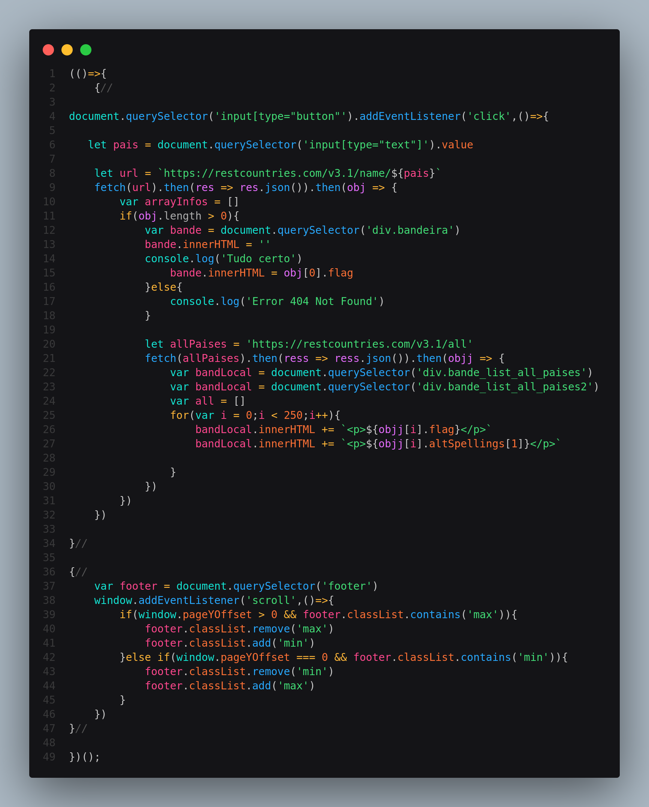

# Pesquiasa de Países usando API



    ## JS
```
    (()=>{
    {//

document.querySelector('input[type="button"').addEventListener('click',()=>{
    
   let pais = document.querySelector('input[type="text"]').value

    let url = `https://restcountries.com/v3.1/name/${pais}`
    fetch(url).then(res => res.json()).then(obj => {
        var arrayInfos = []
        if(obj.length > 0){
            var bande = document.querySelector('div.bandeira')
            bande.innerHTML = ''
            console.log('Tudo certo')
                bande.innerHTML = obj[0].flag
            }else{
                console.log('Error 404 Not Found')
            }

            let allPaises = 'https://restcountries.com/v3.1/all'
            fetch(allPaises).then(ress => ress.json()).then(objj => {
                var bandLocal = document.querySelector('div.bande_list_all_paises')
                var bandLocal = document.querySelector('div.bande_list_all_paises2')
                var all = []
                for(var i = 0;i < 250;i++){
                    bandLocal.innerHTML += `<p>${objj[i].flag}</p>`
                    bandLocal.innerHTML += `<p>${objj[i].altSpellings[1]}</p>`

                }
            })
        })
    })

}//

{//
    var footer = document.querySelector('footer')
    window.addEventListener('scroll',()=>{
        if(window.pageYOffset > 0 && footer.classList.contains('max')){
            footer.classList.remove('max')
            footer.classList.add('min')
        }else if(window.pageYOffset === 0 && footer.classList.contains('min')){
            footer.classList.remove('min')
            footer.classList.add('max')
        }
    })
}//

})();
```

## HTML
```
    <!DOCTYPE html>
<html lang="pt-BR">
<head>
    <meta charset="UTF-8">
    <meta name="viewport" content="width=device-width, initial-scale=1.0">
    <title>Manipulação básica de elementos e conteúdo</title>
    <link rel="stylesheet" href="css/style.css">
</head>
<body>

    <main>

        <div class="cab_too" id="home">
            <h2>Paises Infos</h2>
            <p>Pesquise a bandeira de seu pais</p>
            <input type="text" name="pesquisa" id="pesquisa" placeholder="Pesquisar..."><input type="button" value="Pesquisar...">
        </div><!--cab_too-->

        <div class="paises_box_info_container">

            <div class="card_info_pais">
                <div class="bandeira"><h1></h1></div><!--bandeira-->
            </div><!--card_info_pais-->

        </div><!--paises_box_info_container-->
        <div class="bande_list_all_paises"></div><!--bande_list_all_paises-->
        <div class="bande_list_all_paises2"></div><!--bande_list_all_paises-->
    </main>
    <footer class="max"><p>By DevSozinho</p> - <span><a href="#home">TOPO</a></span></footer>
    
</body>
</html>
<script src="js/script.js"></script>
```

## CSS

```
    *{
    padding: 0;
    margin: 0;
    box-sizing: border-box;
    text-decoration: none;
    font-family: Verdana, Geneva, Tahoma, sans-serif;
    font-weight: normal;
    scroll-behavior: smooth;
}
html,body{
    height: 100%;
    background-color: #0f0f11;
}
/**/
main{
    width: 100%;
    height: 100%;
}
div.cab_too{
    padding: 15px 0;
    max-width: 890px;
    background-color: #141417;
    color: #FFFFFF;
    text-align: center;
    margin: 0 auto;
}
div.paises_box_info_container{
    max-width: 890px;
    margin: 0 auto;
    background-color: #2f2f2f;
    padding: 15px;
    display: flex;
    justify-content: center;
    align-items: center;
    flex-wrap: wrap;
}
div.card_info_pais{
    padding: 20px;
    margin: 5px 8px;
    border-radius: 15px;
    background-color: #565656;
    text-align: center;
    width: calc(100% / 4);
}
div.bandeira{
    width: 100%;
    height: 70px;
    line-height: 70px;
    font-size: 55px;
}
h1,h2,h3,p,hr{
    margin-bottom: 3px;
    color: #CCCCCC;
}
input[name="pesquisa"]{
    width: calc(100% - 50px);
    background-color: #1e1e1f;
    border: none;
    height: 50px;
    line-height: 50px;
    margin: 14px 0;
    padding-left: 8px;
    color: #FFFFFF;
    border-radius: 15px;
    outline: none;
}
div.bande_list_all_paises{
    max-width: 890px;
    margin: 0 auto;
    background-color: #272222;
    padding: 15px;
    display: flex;
    justify-content: center;
    align-items: center;
    flex-wrap: wrap;
    display: flex;
    align-items: center;
    justify-content: center;
}
div.bande_list_all_paises p{
    width: 33px;
    height: 33px;
    display: flex;
    align-items: center;
    justify-content: center;
    border-radius: 8px;
    margin: 5px;
    background-color: #333333;
}
div.bande_list_all_paises2{
    max-width: 890px;
    margin: 0 auto;
    padding: 15px;
    display: flex;
    justify-content: center;
    align-items: center;
    display: flex;
    align-items: center;
    justify-content: center;
    flex-wrap: wrap;
}
div.bande_list_all_paises2 p{
    display: flex;
    align-items: center;
    justify-content: center;
    border-radius: 8px;
    padding: 3px;
    margin: 5px;
    background-color: #141417;
}
footer{
    width: 100%;
    height: 11%;
    background-color: #141417;
    display: flex;
    justify-content: center;
    align-items: center;
    position: fixed;
    top: 90%;
    transition: 0.3s;
    font-size: 13px;
}
.max{
    width: 100%;
    height: 11%;
    background-color: #141417;
    display: flex;
    justify-content: center;
    align-items: center;
    position: fixed;
    top: 90%;
}
.min{
    width: 100%;
    height: 8%;
    background-color: #141417d0;
    display: flex;
    justify-content: center;
    align-items: center;
    position: fixed;
    top: 92%;
}
```